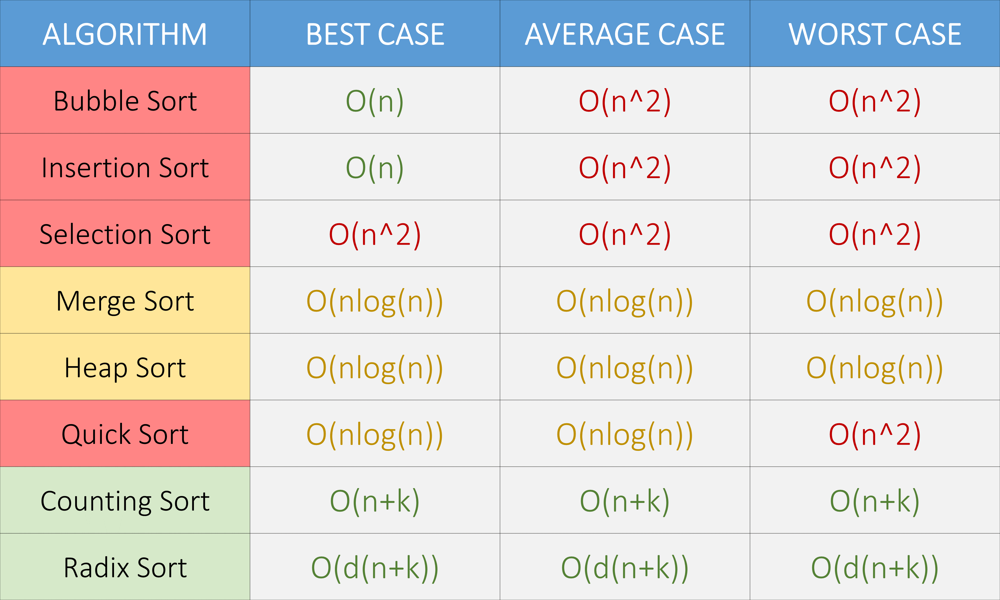

# 912. Sort an Array / 排序数组

Leetcode: https://leetcode.com/problems/sort-an-array/description/

力扣：https://leetcode.cn/problems/sort-an-array/description/

## Overview of Sorting Algorithm/ 排序算法一览



## Solution 1: Merge Sort / **归并排序**

Java

Python

```python
class Solution:
    def sortArray(self, nums: List[int]) -> List[int]:
        def merge(left_array, right_array):
            left_len = len(left_array)
            right_len = len(right_array)
            # array to return
            res = [0] * (left_len + right_len)

            i = 0  # i to keep track of left array index
            j = 0  # j for right array index
            cur = 0  # cur for keep track of res index

            while i < left_len and j < right_len:
                # Select smaller val, and update index pointer
                if left_array[i] < right_array[j]:
                    res[cur] = left_array[i]
                    cur += 1
                    i += 1
                else:
                    res[cur] = right_array[j]
                    cur += 1
                    j += 1

            # Post Processing
            while i < left_len:
                res[cur] = left_array[i]
                i += 1
                cur += 1
            while j < right_len:
                res[cur] = right_array[j]
                j += 1
                cur += 1

            return res

        def mergeSort(nums, left, right):  # Divide and conquer
            # Base Case
            if left == right:
                return [nums[left]]

            # Divide
            mid = left + (right - left) // 2
            # Sort the left half of the array
            left_array = mergeSort(nums, left, mid)
            # wall

            # Conquer(merge)
            # Sort the right have of the array
            right_array = mergeSort(nums, mid + 1, right)

            # merge to array and return
            return merge(left_array, right_array)

        return mergeSort(nums, 0, len(nums) - 1)

```

## Solution 2:
